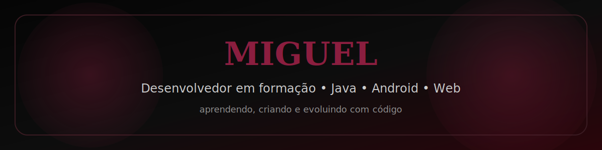
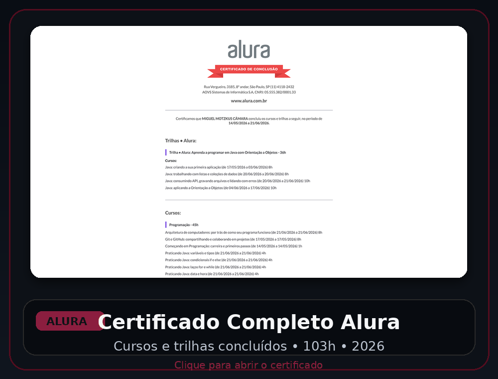
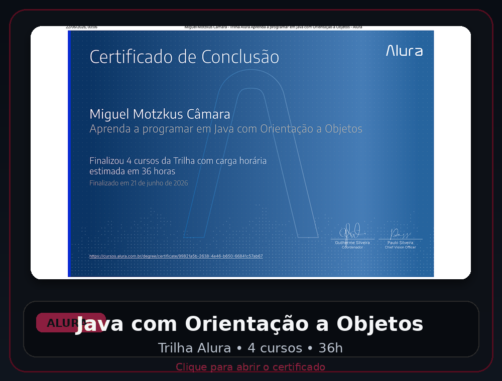
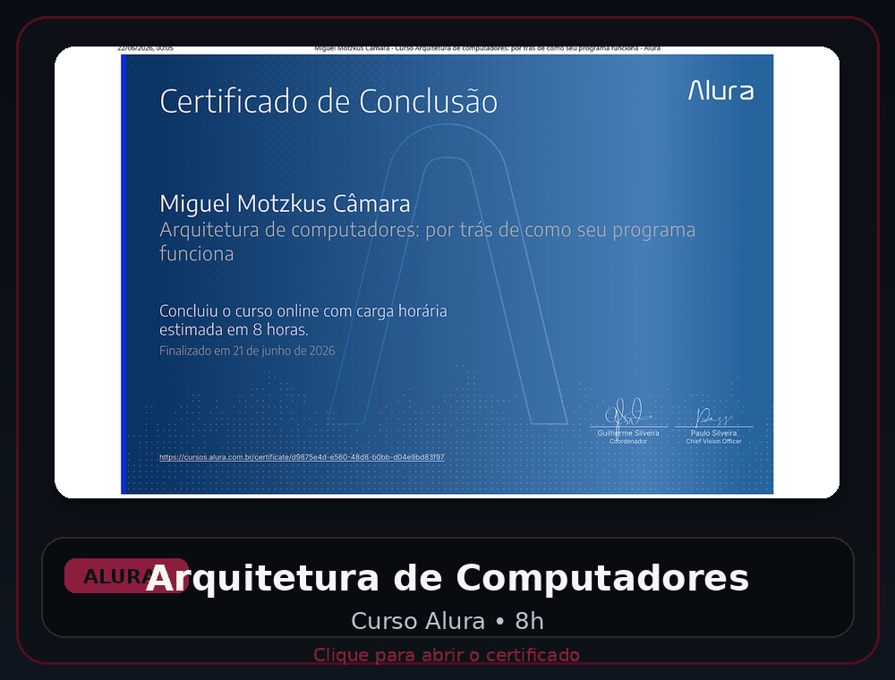
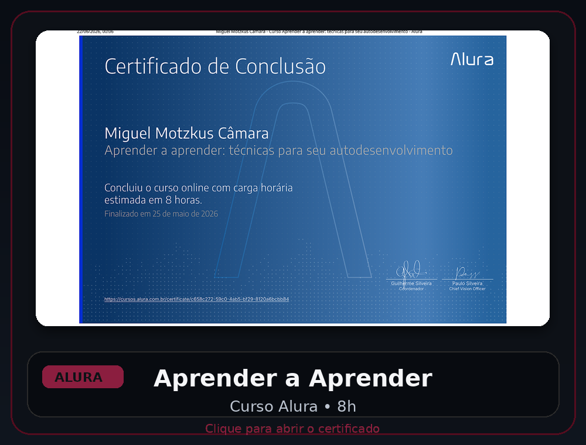

<p align="center">
  
</p>

<p align="center">
  <a href="https://git.io/typing-svg">
    
  </a>
</p>

<p align="center">
  
</p>

<p align="center">
  <a href="https://github.com/MiguelCamMtz">
    
  </a>
</p>

<p align="center">
  
</p>

---


**Desenvolvedor em formação**

> *"Código, aprendizado, erro, correção e evolução."*

Atualmente estou aprofundando meus estudos em **Java**, **Orientação a Objetos**, **desenvolvimento web** e **Android**, aplicando esse conhecimento em projetos pessoais, estudos e ferramentas práticas.

Também tenho experiência com **HTML**, **CSS**, **JavaScript**, **Git**, **GitHub**, **Linux** e estou sempre explorando novas tecnologias para evoluir como desenvolvedor.

```txt
◈  Classe    →  Aprendiz Java / Android
◈  Origem    →  Brasil
◈  Caminho   →  Open Source
◈  Build     →  Lógica / Criatividade
◈  Status    →  Aprendendo. Criando. Evoluindo.
```

---

## Tecnologias


---

## Estatísticas

<p align="center">
  
</p>

<p align="center">
  
  
</p>

---

## Gráfico de Contribuições

[](https://github.com/MiguelCamMtz)

---

## Formação & Certificados

<p align="center">
  
  
  
</p>

| Foco | Status |
|:---|:---:|
| Java com Orientação a Objetos | Concluído — 36h |
| Programação e lógica | Concluído — 45h |
| Inovação, gestão e autodesenvolvimento | Concluído — 22h |
| Git, GitHub, Linux, Android e Web | Aprendendo na prática |

<div align="center">
  <table>
    <tr>
      <td align="center" width="50%">
        <a href="https://cursos.alura.com.br/user/miguelmotzkuscamara/fullCertificate/f06fb8b6912b8e59773627666b580c74">
          
        </a>
      </td>
      <td align="center" width="50%">
        <a href="https://cursos.alura.com.br/degree/certificate/99821a5b-2638-4e46-b650-66841c57ab67">
          
        </a>
      </td>
    </tr>
    <tr>
      <td align="center" width="50%">
        <a href="https://cursos.alura.com.br/certificate/d9875e4d-e560-48d8-b0bb-d04e9bd83f97">
          
        </a>
      </td>
      <td align="center" width="50%">
        <a href="https://cursos.alura.com.br/certificate/c658c272-59c0-4ab5-bf29-8120a6bcbb84">
          
        </a>
      </td>
    </tr>
    <tr>
      <td align="center" colspan="2">
        <a href="https://cursos.alura.com.br/certificate/1cb19866-ef03-4076-9410-dc2ff5caed48">
          
        </a>
      </td>
    </tr>
  </table>
</div>

<details>
  <summary><strong>Backups em PDF</strong></summary>

  - [Certificado completo Alura](./certificados/pdf/certificado-alura-completo.pdf)
  - [Trilha Java com Orientação a Objetos](./certificados/pdf/trilha-java-orientacao-objetos.pdf)
  - [Arquitetura de Computadores](./certificados/pdf/curso-arquitetura-de-computadores.pdf)
  - [Aprender a Aprender](./certificados/pdf/curso-aprender-a-aprender.pdf)
  - [Começando em Programação](./certificados/pdf/curso-comecando-em-programacao.pdf)
</details>

---

<p align="center">
  <em>† Continue codando para superar qualquer bug †</em>
</p>
